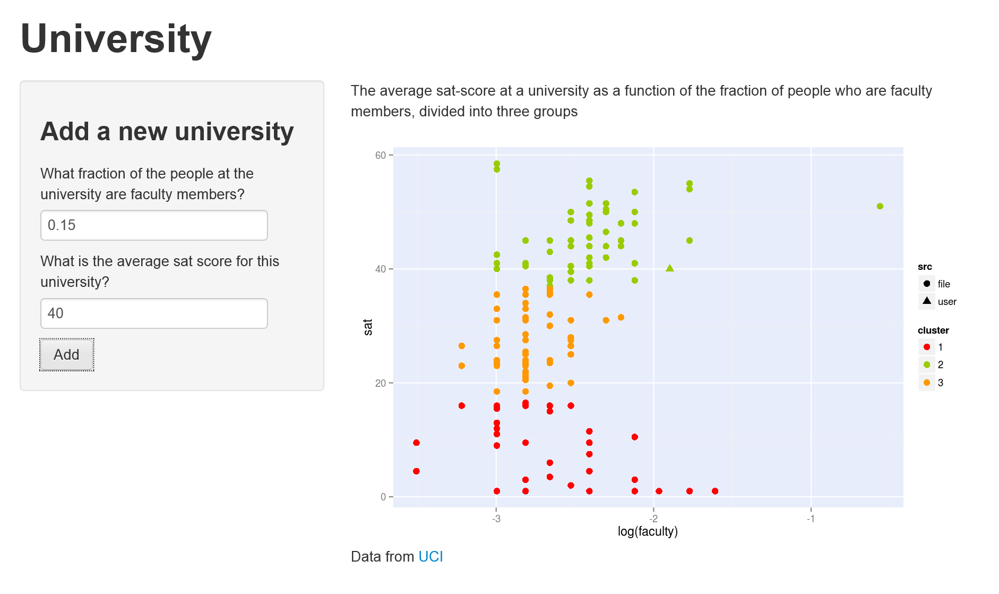

<style> 
.title-slide {
  background-color: #FFFFFF; /* #EDE0CF; ; #CA9F9D*/
}

</style>

## Data

The Shiny app 'Universities' uses the University dataset from [UCI](https://archive.ics.uci.edu/ml/datasets/University). This set provides data from a large number of US universities. The app plots the average sat-score of admitted students against the fraction of people at the university who are faculty-members. The universities are clustered into three groups and the source of the data is recorded.
```{r include = FALSE}
library(RColorBrewer)
library(ggplot2)

# calculate a fraction based on a ratio
# the input is a factor vector of the form a:b
fraction <- function (v) {
  v <- as.character(v)
  fract.first <- c()
  for (rat in v) {
    fracts <- as.numeric(strsplit(rat, split = ':')[[1]]) # isolate the factors
    tot <- fracts[1] + fracts[2] # compute the total
    first <- fracts[1]
    fract.first <- c(fract.first, round(first / tot, 2)) # compute the fraction
  }
  fract.first
}

# costumized plot
# creates a scatterplot of clustered individuals colored by cluster
myPlot <- function(df) {
  clusterCols <- c("red", "#99CC00", "#FF9900")
  names(clusterCols) <- levels(df$cluster)
  clusterColScale <- scale_colour_manual(name= "cluster", values = clusterCols)
  
  plot <- ggplot(data = df, aes(x = log(faculty), y = sat, colour = cluster, shape = src)) + 
    geom_point(size = 3) +
    theme(panel.background = element_rect(fill = '#E8EDFB')) +
    clusterColScale
}

# read in data and create the desired format
unis <- read.csv("unis.csv", header = TRUE)
unis$uniName <- as.character(unis$uniName)
unis$sat.verbal <- as.numeric(unis$sat.verbal)
unis$sat.math <- as.numeric(unis$sat.math)

fract.faculty <- 1 - fraction(unis$student.faculty.ratio)
unisF <- cbind(unis, fract.faculty)

# the relevant data
uniQuality <- data.frame(university = unisF$uniName,
                         faculty = unisF$fract.faculty, 
                         sat = (unisF$sat.math + unisF$sat.verbal) / 2 )

# select only those entries which does not contain any NA
# (NA causes problems with clustering)
completeEntries <- complete.cases(uniQuality$faculty, uniQuality$sat)
dataForClustering <- data.frame(faculty = uniQuality$faculty, sat = uniQuality$sat)[completeEntries,]

set.seed(113)
```

```{r}
model <- kmeans(dataForClustering, centers = 3)
```

```{r include = FALSE}
# create a column which indicates where a certain datapoint comes from
# this will become usefull in the interactive part where users can add their own datapoints
src <- rep(factor('file'), nrow(dataForClustering))
levels(src) = c('file', 'user')
lengthSrc <- length(src)
```

```{r}
uniQC <- cbind(dataForClustering, cluster = as.factor(model$cluster), src = src)
head(uniQC)
```

--- .class #id 

## App

The app displays the data and allows the user to add new datapoints.


---

## New Data

New data can be added by giving values in the textboxes and hitting the add-button. More data can be added by repeating the process.




---

## Interpretation

The plot shows very little correlation between the percentage faculty members and the average sat-scores of admitted students. The correlation is equal to

```{r}
cor(uniQC$faculty, uniQC$sat)
```

which is indeed very little. This suggests that universities who invest in their education by hiring many faculty members do not necesserily have a strong selection on their applicants.

The clustering on the data is mainly for show and does not serve any genuine purpose.